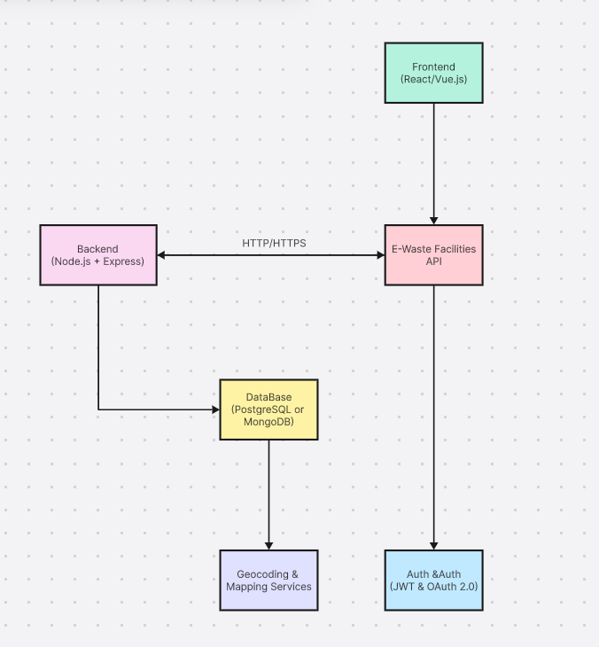
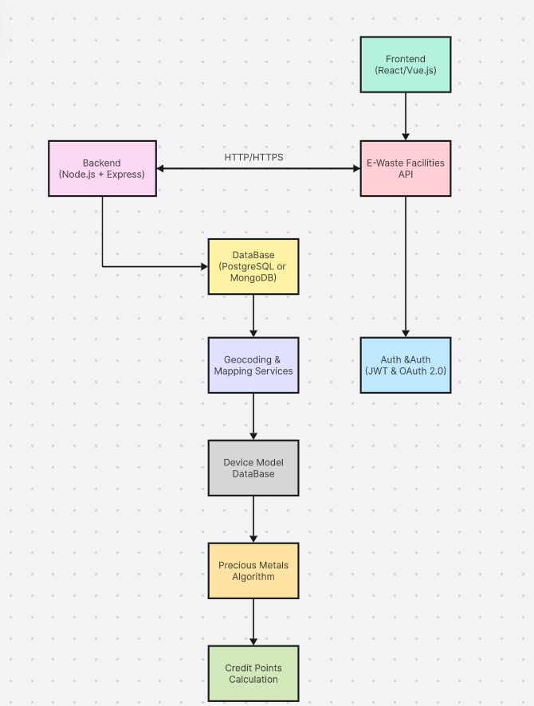

# Smart India Hackathon Workshop
# Date:19-05-2024
## Register Number:212223230201
## Name: SETHUKKARASI C
## Problem Title
E-Waste Facility Locator
## Problem Description
Website that tells you the location of the nearest e-waste collection and recycling facility. Offers educational pop-ups on the harmful components of your e-waste and their effects on the environment and human health if not disposed correctly. There could be an option to input the model of your old device and earn credit points relative to the amount of precious metals recovered from the device if disposed correctly.
## Problem Creater's Organization
Ministry of Environment

## Idea
The solution involves developing a user-friendly web or mobile platform that enables users to locate nearby e-waste collection and recycling facilities, access educational content on proper e-waste disposal, and participate in a rewards system for responsible recycling. Utilizing a database of global e-waste facilities, users can input their location or enable geolocation services to find the nearest facility. Educational content highlights the environmental and health impacts of improper disposal, while a rewards system incentivizes users to recycle by offering points or discounts based on the value of materials recovered from their devices. Integration with external APIs provides up-to-date facility information and mapping services for user convenience. User authentication and account management features enable personalized experiences, while community engagement tools encourage sharing and collaboration. Continuous improvement through user feedback and analytics ensures the platform remains effective and relevant in promoting sustainable e-waste recycling practices.

## Proposed Solution / Architecture Diagram

The proposed solution could be a web application accessible through both desktop and mobile devices. The architecture could consist of the following components:

### 1. Frontend:
 The user interface where users can input their location, learn about e-waste, and access educational pop-ups. This could be built using HTML, CSS, and JavaScript frameworks like React or Vue.js for interactivity.

### 2. Backend:
 The backend server will handle user requests, process data, interact with the database, and communicate with external APIs. You could use Node.js with Express.js for building the backend.

### 3. Database:
 Store information about e-waste collection facilities, user accounts, and devices. You could use a relational database like PostgreSQL or a NoSQL database like MongoDB, depending on your data structure and scalability needs.

### 4. E-Waste Collection Facilities API:
 Integrate with an external API or databases provided by government agencies or environmental organizations to fetch information about e-waste collection facilities worldwide.

### 5. Geocoding and Mapping Service:
 Use a mapping service like Google Maps or Mapbox for geocoding user input, displaying e-waste collection facility locations, and providing directions.

### 6. Authentication and Authorization:
 Implement user authentication and authorization to manage user accounts and access control.

## Use Cases

1. **Find Nearest E-Waste Facility:** Users can input their location or allow the website to access their current location to find the nearest e-waste collection and recycling facility.

2. **Educational Pop-ups:** When users search for e-waste facilities or browse the website, educational pop-ups can provide information about the harmful components of e-waste and their environmental and health effects.

3. **Device Model Input:** Users can input the model of their old devices, and based on this information, earn credit points relative to the amount of precious metals recovered from the device if disposed correctly.

## Technology Stack

- Frontend: HTML, CSS, JavaScript, React.js or Vue.js
- Backend: Node.js, Express.js
- Database: PostgreSQL or MongoDB
- APIs: External e-waste collection facilities API, Geocoding and Mapping Service API (e.g., Google Maps API, Mapbox API)
- Authentication: JSON Web Tokens (JWT), OAuth
- Deployment: Docker, AWS, Heroku, or similar platforms

## Dependencies
Budget: Variable based on location
Data collection: 4 Weeks
Mapping services timing: 16 Days
